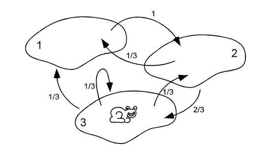
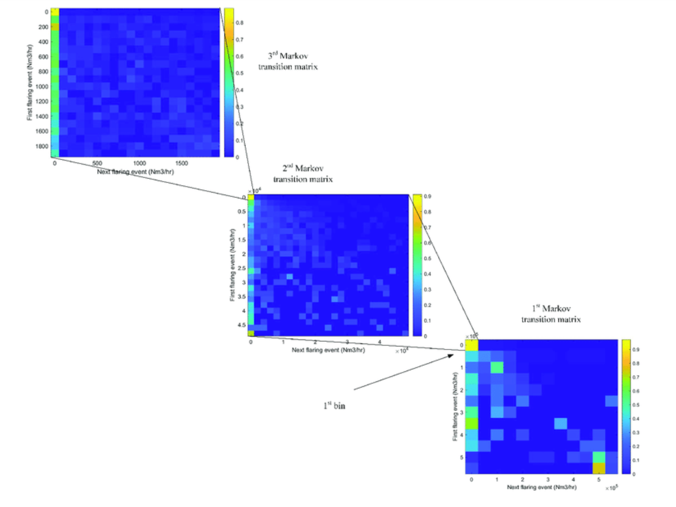

# random-lab

A playground for experimenting with Markov chains and probability distributions.

From raw sequences of states to a formal **transition matrix** \(P\), and then to how distributions evolve:

$$
\mu_n = \mu_0 P^n, \quad \pi = \pi P, \quad \sum_i \pi_i = 1
$$

## Markov frog 🐸

## Visualization

The goal of the project is to **visualize results** with:

- heatmaps of the transition matrix,
- distribution plots showing evolution over time.  

Example:

## References  
- [Markov chains - J. Chang, February 2, 2007](http://www.stat.yale.edu/~pollard/Courses/251.spring2013/Handouts/Chang-MarkovChains.pdf)
- [Heatmapper2: web-enabled heat mapping made easy](https://academic.oup.com/nar/article/53/W1/W316/8124939?login=false)

